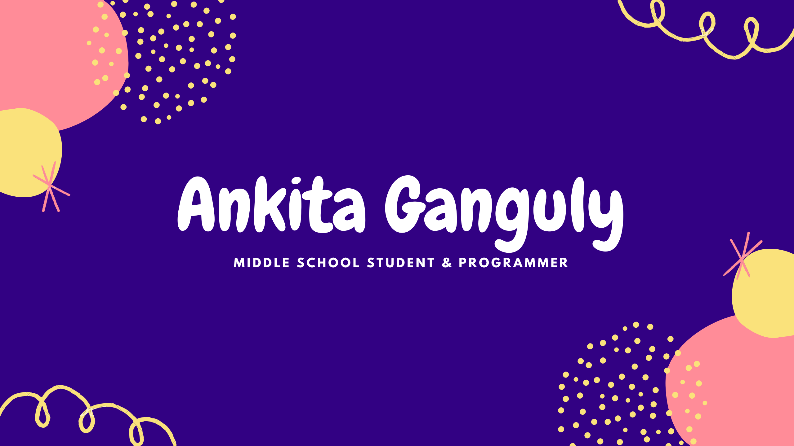

<h1> <b>👋🏻Hello World👋🏻</b> </h1>

I'm Ankita Ganguly, a middle school student who loves programming. Twelve year old and I've started my 'coding' journey with block codes. Currently, I'm learning Python and Web Development. I'm interested in pursuing a career in Artificial Intelligence or Machine Learning. I've made pretty simple and basic projects (not fancy or very professional). My basic skills include app development with block codes and small Python games. 

- 🌱 I’m currently learning Python and Web Dev
- 😄 Pronouns: She, her, hers
- ⚡ Fun fact: I started coding with block codes :)
